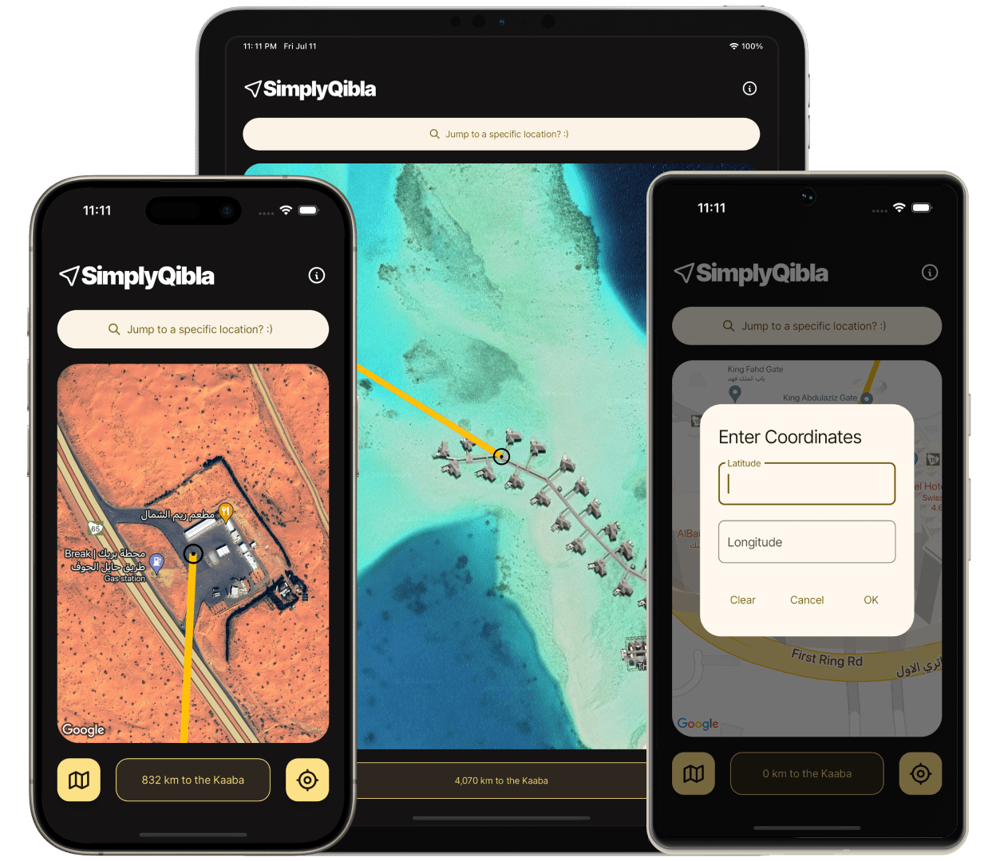

<h3 align="center">
    
</h3>

<h3 align="center">A minimalist, accurate, and privacy-focused qibla app.</h3>

    <a href="https://play.google.com/store/apps/details?id=com.towardsikhlaas.simplyqibla">Android</a>
    ·  
    <a href="https://apps.apple.com/app/id6504881956">iOS</a>
    ·  
    <a href="https://www.instagram.com/towardsikhlaas">Instagram</a>
    ·  
    <a href="https://www.youtube.com/@towardsikhlaas">YouTube</a>

<h3 align="center"></h3>

# SimplyQibla: Qibla Map

SimplyQibla is a no-frills qibla finder app that lets you find the exact prayer direction for your location, while respecting your privacy.

### Features

- **Accurate**: The device compass easily fluctuates and shows the wrong qibla direction, but a map remains factual.
- **Privacy-focused**: You don't need to grant location permissions for the app to work. You can simply enter the coordinates of a location.
- **Ad-free and Open-Source**: We don't nag you with annoying ads, and we don't collect your data either. Our source-code is public and easily auditable.
- **Minimalist Design**: Built with Google's latest design language.

## Getting Started

These instructions will get you a copy of the project up and running on your local machine for development and testing purposes. See deployment for notes on how to deploy the project on a live system.

### Prerequisites

- A development machine that supports the [latest version of Flutter](https://docs.flutter.dev/release/release-notes).
- For iOS-specific development, you will need a MacOS device compatible with Xcode.

### Set Up

To get a development env running:

1. Set up Flutter for your environment by following the steps provided in the [official guide](https://docs.flutter.dev/get-started/install).

2. Clone the [simply_qibla](https://github.com/TowardsIkhlaas/simply_qibla) repository.

3. Run `flutter pub get` at project root to install the packages listed in [pubspec.yaml](https://github.com/TowardsIkhlaas/simply_qibla/blob/master/pubspec.yaml).

4. Follow the set-up steps for the Google Maps API using their [official guide](https://pub.dev/packages/google_maps_flutter#getting-started) to create your maps API key.

5. Define the API key in key.properties in the `android/` directory for Android, and APIKey.plist in the `ios/Runner/` directory for iOS. See [key.properties.example](https://github.com/TowardsIkhlaas/simply_qibla/blob/master/android/key.properties.example) and [APIKey.plist.example](https://github.com/TowardsIkhlaas/simply_qibla/blob/master/ios/Runner/APIKey.plist.example) files for correctly defining the API key.

6. Connect the target (usually a virtual emulator or physical device) to your development machine to run the app.

7. Go to Run > Start Debugging on your IDE and wait for the app to launch.

You should see the app running now on the target device.

## Running Tests

To run the tests located in the `test/` directory, run:

`flutter test`

### Code Style Tests

Currently, there is a [GitHub action](https://github.com/TowardsIkhlaas/simply_qibla/blob/master/.github/workflows/ci.yml) that runs for every pull request to `master`, ensuring the code conforms to the linter rules. See [analysis_options.yaml](https://github.com/TowardsIkhlaas/simply_qibla/blob/master/analysis_options.yaml) for current code style rules, and [Dart.dev](https://dart.dev/tools/linter-rules) for a list of all available linter rules.

## Build and Deploy

Build the IPA or AAB file with the following commands:

- IPA: `flutter build ipa`
- AAB: `flutter build appbundle`

For detailed deployment steps, see the [official Flutter documentation](https://docs.flutter.dev/deployment).

## Contributing

Please read [CONTRIBUTING.md](https://github.com/TowardsIkhlaas/simply_qibla/blob/master/.github/CONTRIBUTING.md) for details on our code of conduct, and the process for submitting pull requests to us.

## Versioning

We use [SemVer](http://semver.org) for versioning. For the versions available, see the [tags on this repository](https://github.com/TowardsIkhlaas/simply_qibla/tags).

## License

This project is licensed under the GPL License - see the [LICENSE](LICENSE) file for details.

## Acknowledgments

- Thanks to the team at [Flutter](https://flutter.dev) for making this process easier.
- Maps functionality via the [Google Maps Flutter](https://pub.dev/packages/google_maps_flutter) package.
